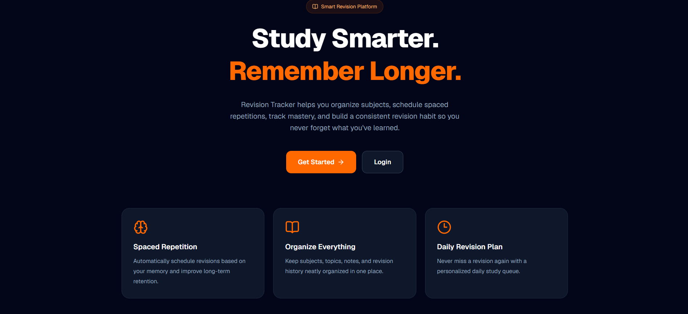
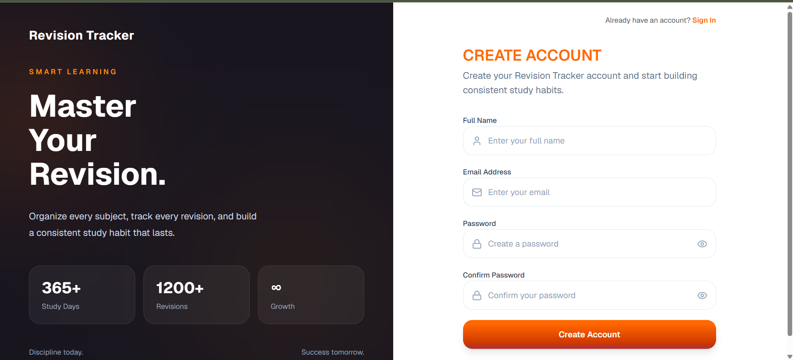
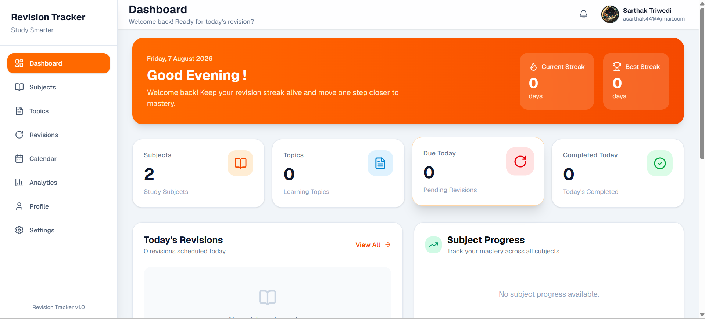
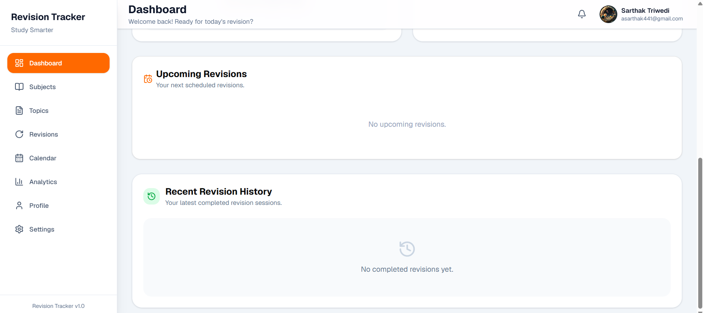
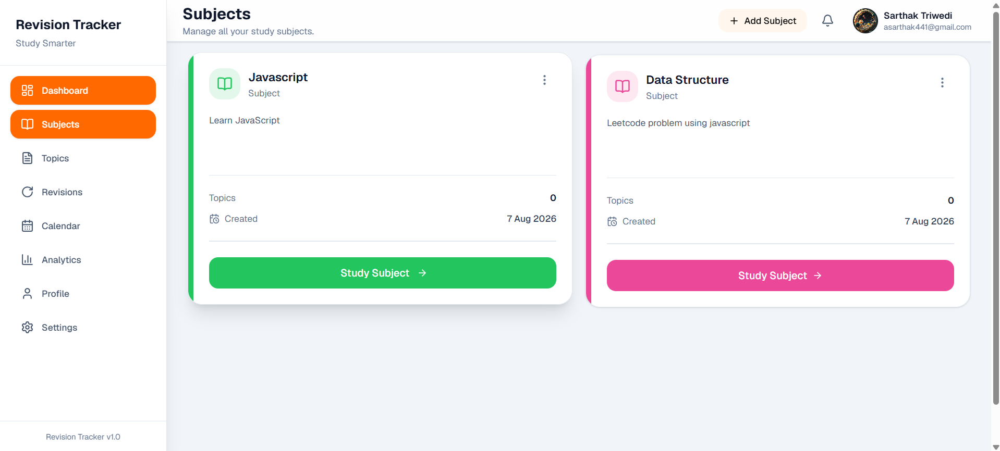
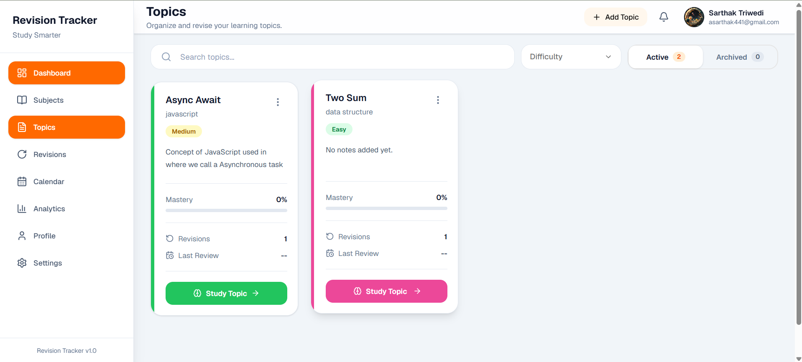

# 📚 Revision Tracker

<p align="center">
  
</p>

<h3 align="center">
Study Smarter • Revise Better
</h3>

<p align="center">
A full-stack MERN application that helps students retain knowledge using the <b>Spaced Repetition</b> learning technique.
</p>

<p align="center">


</p>

---

# Live Demo

### Frontend

https://revision-tracker-rho.vercel.app

### Backend API

https://revision-tracker-api.onrender.com

---

# About

Revision Tracker is a production-ready MERN Stack application designed to help students build long-term memory through intelligent revision scheduling.

Instead of repeatedly studying everything, the application automatically schedules revisions using a spaced repetition algorithm based on the user's performance after every study session.

Users can organize their learning into Subjects and Topics, maintain revision notes, monitor mastery progress, and build a consistent revision habit.

---

# Features

## Authentication

- User Registration
- Login
- JWT Authentication
- Email Verification using OTP
- Forgot Password
- Reset Password
- Protected Routes

---

## Subject Management

- Create Subject
- Edit Subject
- Delete Subject
- Custom Subject Colors
- Responsive Cards

---

## Topic Management

- Create Topic
- Edit Topic
- Archive Topic
- Restore Topic
- Delete Topic
- Difficulty Levels
- Personal Notes
- Mastery Progress
- Revision Counter

---

## Smart Revision System

- Daily Revision Queue
- Spaced Repetition Scheduling
- Revision Ratings

  - Again
  - Good
  - Easy

- Automatic Next Revision
- Revision History
- Mastery Calculation

---

## Dashboard

- Today's Revisions
- Total Subjects
- Total Topics
- Active Topics
- Archived Topics
- Revision Statistics

---

## Profile

- Update Profile
- Upload Avatar
- Cloudinary Image Storage

---

## Responsive Design

- Mobile Friendly
- Tablet Optimized
- Laptop Optimized
- Desktop Optimized

---

## UX Features

- Skeleton Loading
- Toast Notifications
- Empty States
- Confirmation Dialogs
- Beautiful Landing Page

---

# Tech Stack

## Frontend

- React 19
- React Router DOM
- Tailwind CSS v4
- Base UI
- React Hook Form
- Zod
- Axios
- Sonner
- Lucide Icons

---

## Backend

- Node.js
- Express.js
- MongoDB Atlas
- Mongoose
- JWT
- Bcrypt
- Nodemailer
- Cloudinary
- Multer
- Node Cron

---

# Project Structure

```
Revision-Tracker

├── backend
│ ├── config
│ ├── controllers
│ ├── cron
│ ├── middlewares
│ ├── models
│ ├── routes
│ ├── services
│ ├── templates
│ └── utils
│
├── frontend
│ ├── components
│ ├── layouts
│ ├── pages
│ ├── routes
│ ├── context
│ ├── hooks
│ ├── api
│ └── schemas
```

---

# Application Flow

```
Register

↓

Verify Email

↓

Login

↓

Dashboard

↓

Create Subject

↓

Create Topic

↓

Study Topic

↓

Start Revision

↓

Rate Yourself

↓

Automatic Next Revision
```

---

# Spaced Repetition Flow

```
Topic Created

↓

Revision 1

↓

Again
↓

Soon

Good
↓

Normal

Easy
↓

Later

↓

Next Revision Generated Automatically
```

---

# Screenshots

## Landing Page



---

## Login Page


---

## Register Page



## Dashboard





---

## Subject Management



---

## Topic Management



---

## Study Topic


---

## Study Revision

(Add Screenshot)

---

# 🚀 Installation

Clone Repository

```bash
git clone https://github.com/Sarthak-Deadpool/revision-tracker.git
```

Backend

```bash
cd backend
npm install
npm run dev
```

Frontend

```bash
cd frontend
npm install
npm run dev
```

---

# ⚙️ Environment Variables

Backend

```env
MONGO_URI=

JWT_SECRET=

EMAIL_USER=

EMAIL_PASS=

CLIENT_URL=

CLOUDINARY_CLOUD_NAME=

CLOUDINARY_API_KEY=

CLOUDINARY_API_SECRET=
```

Frontend

```env
VITE_API_BASE_URL=
```

---

# 🛣️ Roadmap

- Calendar View
- Analytics Dashboard
- Notifications
- Dark Mode
- PDF Notes
- Revision Insights
- AI Assisted Revision
- PWA Support

---

# 🤝 Contributing

Contributions are welcome.

Feel free to fork the repository and submit a pull request.

---

# 👨‍💻 Author

**Sarthak Arya**

GitHub:
https://github.com/Sarthak-Deadpool

LinkedIn:
(Add LinkedIn URL)

---

# ⭐ Support

If you found this project useful, please consider giving it a ⭐ on GitHub.